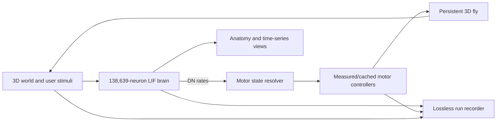

# FlyWire Neuro

[](LICENSE)
[](https://www.python.org/)
[](https://doi.org/10.5281/zenodo.10676866)
[](https://github.com/TuragaLab/flybody)

An open research prototype that connects a 138,639-neuron leaky integrate-and-fire (LIF) model of the adult *Drosophila melanogaster* brain to a persistent 3D body and environment.

The browser is intentionally a thin client. The full connectome simulation runs locally, descending-neuron (DN) activity selects motor controllers, and measured walking/flight clips plus cached neuromechanical poses animate a single continuous fly. Every run is recorded for later analysis.

> **Research status:** experimental prototype, not a biologically validated digital organism. DN-to-behavior mappings, stimulus calibration, and several transitions remain hypotheses or engineering approximations. See [Limitations](#limitations) and [Where help is needed](#where-help-is-needed).

## What is implemented

- 138,639-neuron recurrent LIF simulation on FlyWire-derived connectivity.
- Interactive visual, gustatory, mechanosensory, olfactory, and walking stimuli.
- Causal DN-to-motor state resolution with separate behavioral intent and flight state.
- One persistent body across walking, backward walking, grooming, feeding, takeoff, measured flight maneuvers, landing, and idle transitions.
- Walking and flight trajectories retargeted from the FlyBody imitation datasets.
- Eye-cleaning foreleg motion and a separate articulated proboscis overlay.
- Millimetre-scale 3D arena with continuous room exploration and boundary avoidance.
- FlyWire dorsal anatomy view using 10,000 sampled real soma positions.
- Automatic gzip-compressed JSONL recording of neural, body, stimulus, and timing events.
- Two timing modes: smooth 30 Hz wall-time playback and exact computed-brain-time synchronization.

## Architecture



The current world-to-brain loop is partly closed: users can change stimuli while the brain runs, and DN activity causally selects the body controller. Automatic physical contacts and continuously generated sensory observations are still under development.

## Timing modes

The simulation has three distinct clocks. Keeping them separate is essential when interpreting a run.

| Clock | Meaning |
|---|---|
| Wall time | Real elapsed time measured by the server recorder. |
| Brain simulation time | Biological-model time advanced by the 0.1 ms LIF integration step. |
| Body simulation time | Time consumed by the 30 Hz motor trajectory. |

By default, the body advances at 30 Hz wall time and uses the latest available DN state. This gives an observable interactive demo even when the full brain is much slower than real time.

When **Real-time LIF sync** is checked before **Start Digital Life**, one motor frame advances only after 33.33 ms of computed LIF time has accumulated. The slowdown is therefore measured, not hard-coded. Development runs have varied with system load (for example, 231 ms of brain time in 95.58 s of wall time is about 414×), so the observed roughly 440× rate is only a guide. Other CPUs will produce a different ratio.

## Requirements

Recommended development environment:

- macOS or Linux; Windows through WSL2 is untested.
- Python 3.10. Python 3.11/3.12 may work, but FlyBody's documented environment uses 3.10.
- 16 GB RAM recommended for the LIF model and sparse connectivity caches.
- About 1 GB for the connectome/runtime files, or 8+ GB if all optional motion and analysis datasets are installed.
- A modern browser with WebGL 2 support.
- Internet access at page load for the current Three.js CDN scripts. Vendor those scripts under `web/frontend/` for a fully offline deployment.
- CPU execution works. CUDA support is not currently wired into the web endpoint.

## Quick start

### 1. Clone and install

```bash
git clone https://github.com/pusulamkendim/flywire-neuro.git
cd flywire-neuro

python3.10 -m venv .venv
source .venv/bin/activate
python -m pip install --upgrade pip
pip install -r requirements.txt
```

The repository contains the compact FlyWire-derived connectivity tables used by the web LIF model under `fly-brain-embodied/data/`. Large upstream datasets and generated weight matrices are intentionally not committed.

### 2. Download the required annotations

The interactive brain reads the FlyWire neuron annotation table from `data/neuron_annotations.tsv`.

```bash
mkdir -p data
curl -L \
  https://raw.githubusercontent.com/flyconnectome/flywire_annotations/main/supplemental_files/Supplemental_file1_neuron_annotations.tsv \
  -o data/neuron_annotations.tsv
```

### 3. Download motion data

Download version 4 of the [FlyBody supporting dataset](https://doi.org/10.25378/janelia.25309105). The full download is approximately 4.05 GB compressed. For this web prototype, only these three small source files are required:

```text
data/simulation/
├── datasets_flight-imitation/
│   ├── flight-dataset_saccade-evasion_augmented.hdf5   (~14 MB)
│   └── wing_pattern_fmech.npy
└── datasets_walking-imitation/
    └── walking-dataset-small_female-only_snippets-100_min-len-0.5s_trk-files-0-9.hdf5   (~95 MB)
```

Command-line download of the complete archive:

```bash
curl -L \
  https://janelia.figshare.com/ndownloader/articles/25309105/versions/4 \
  -o flybody-datasets-v4.zip
unzip flybody-datasets-v4.zip -d flybody-datasets-v4
```

Copy the three files above from the extracted folders into the exact project paths shown. The 6.4 GB full walking HDF5 file is useful for new trajectory research but is not required by the current preview builder.

### 4. Optionally download the analysis connectome

The offline analysis scripts `02_*.py` through `16_*.py` use the aggregated v783 connection table. It is not required merely to run the web app.

```bash
curl -L \
  "https://zenodo.org/records/10676866/files/proofread_connections_783.feather?download=1" \
  -o data/proofread_connections_783.feather
```

The official Zenodo record publishes an MD5 checksum (`f48f972d262323a102aed49af1396b8a`) for this file.

### 5. Build motion preview caches

The release includes the base model assets and controller caches. Rebuild the two measured-data preview caches after changing source datasets or conversion code:

```bash
cd web/backend
../../.venv/bin/python flight_data_preview.py
../../.venv/bin/python walking_data_preview.py
cd ../..
```

Generated files are written to `web/backend/walk_cache/`.

### 6. Start the web app

```bash
cd web/backend
../../.venv/bin/python -m uvicorn main:app --host 127.0.0.1 --port 8000
```

Open [http://127.0.0.1:8000](http://127.0.0.1:8000).

The first LIF start may take longer because `weight_coo.pkl` and `weight_csr.pkl` are built in `fly-brain-embodied/data/`. Together they use roughly 600 MB and are ignored by Git. Later starts reuse them.

## Using the interface

1. Select zero or more stimulus buttons. Stimuli can also be toggled while the simulation runs.
2. Leave **Real-time LIF sync** unchecked for smooth 30 Hz observation, or check it for strict brain-time/body-time coupling.
3. Press **Start Digital Life**. Loading 138K neurons can take several seconds.
4. Inspect DN output, neuromodulator/population charts, flight state, anatomy activity, and the persistent body.
5. Press **Stop** to close and flush the recording.

The separate **Behavior Replay**, **Flight Data Preview**, and **Walking Data Preview** controls are diagnostic tools. They isolate motion quality from the full-brain controller.

## Public deployment warning

The current FastAPI process has one global simulation state, no authentication, and no request quotas. Do not expose the development `uvicorn` command directly to the public internet. A public instance should sit behind TLS, authentication/rate limiting, bounded recording storage, and process isolation. For a low-cost public demo, prefer replay-only endpoints; let advanced users run the full LIF worker and licensed datasets locally.

## Simulation records

Every simulation is recorded under:

```text
web/backend/simulation_records/<timestamp>_<simulation-type>/
├── manifest.json
└── frames.jsonl.gz
```

Each JSONL row has a monotonic `recorded_elapsed_ms` plus a `clock` object. Digital Life rows may include `body_runtime_ms`, `body_simulation_ms`, and `brain_simulation_ms`. Do not compare `t_ms` fields from different producers without checking `clock`.

Inspect a recording:

```bash
gzip -cd web/backend/simulation_records/<run>/frames.jsonl.gz | head
python -m json.tool web/backend/simulation_records/<run>/manifest.json
```

The latest completed run can also be downloaded from the right-hand **Simulation Records** section.

## Brain Activity view

The static anatomy is based on real FlyWire soma coordinates and neurotransmitter annotations. For browser performance, 10,000 soma points are sampled from the 139,244 annotated neurons.

Runtime highlights are scientifically more limited: aggregate PAM, PPL1, and MBON spike counts plus DN rates are projected onto related anatomical classes. Activity is normalized to the motor resolver's DN thresholds so a behaviorally effective signal is visually obvious. The view does **not** yet show the exact spiking soma for every LIF neuron.

## Repository map

```text
flywire-neuro/
├── web/
│   ├── backend/
│   │   ├── main.py                  FastAPI and WebSocket entry point
│   │   ├── brain_interactive.py     138K LIF runtime
│   │   ├── digital_life.py          persistent DN-driven body
│   │   ├── motor_state_resolver.py  intent/flight state machine
│   │   ├── simulation_recorder.py   lossless run recording
│   │   ├── *_data_preview.py        measured-motion conversion
│   │   └── worlds/                   world configuration
│   └── frontend/
│       ├── js/room.js               Three.js world and fly rendering
│       ├── js/brain_vis.js          FlyWire anatomy/activity view
│       └── assets/                  GLB models and compact maps
├── fly-brain-embodied/
│   ├── code/run_pytorch.py          sparse recurrent LIF implementation
│   └── brain_body_bridge.py         neuron/stimulus definitions
├── data/                              local upstream data; Git-ignored
├── results/                           offline analysis outputs
├── 02_*.py … 25_*.py                 connectome analyses and experiments
└── IMPROVEMENT_POINTS.md              estimated improvement backlog
```

## Scientific analysis pipeline

The repository began as a neurotransmitter and signal-propagation analysis of FlyWire v783. The numbered scripts cover neurotransmitter distributions, dopamine/serotonin systems, PAM/PPL1 timing, olfactory and taste propagation, Hebbian learning, sensitivity analysis, and embodied experiments. Generated figures and reports are under `results/`.

These results should be treated as computational findings of the stated model. Claims such as PPL1-before-PAM priority require independent biological validation.

## Limitations

- The connectome is structural; synaptic dynamics, receptor types, gap junctions, and many neuromodulatory effects are simplified.
- LIF parameters are mostly global rather than cell-type-specific.
- CPU execution of 138K neurons is far slower than biological real time.
- The default smooth display decouples motor playback speed from computed brain time.
- DN response calibration currently covers only part of the sensory/behavioral space; grooming has especially limited recorded DN evidence.
- The anatomy view shows aggregate projections, not true per-neuron dynamic spikes.
- Measured motion clips are retargeted and blended; most motor output is not generated by a live muscle/physics controller.
- Feeding uses a compatible FlyBody proboscis overlay because the base NeuromechFly mesh lacks equivalent mouth articulation.
- Environment contacts do not yet generate a complete continuous sensory stream.
- Only one local simulation can run per backend process.

## Where help is needed

Contributions are particularly useful in these areas:

1. **Per-neuron activity visualization** — map emitted LIF spike indices to sampled soma IDs, add WebGL/WebGPU level-of-detail rendering, and distinguish measured from inferred activity.
2. **Faster brain execution** — benchmark sparse CUDA, Apple Metal, graph partitioning, and remote workers while preserving deterministic recordings.
3. **DN calibration** — add reproducible experimental datasets and uncertainty estimates for grooming, feeding, courtship, flight initiation, steering, and landing.
4. **Closed-loop sensing** — derive visual loom, odor concentration, taste, touch, and collision stimuli from the actual 3D world state.
5. **Motor realism** — replace clip switching with phase-aware interpolation or closed-loop FlyBody/FlyGym policies; improve foot contact, wing roots, takeoff, and landing.
6. **Environment design** — biologically plausible scale, occlusion, food patches, threats, airflow, and collision-safe navigation.
7. **Validation** — compare trajectories, gait phase, occupancy, reaction latency, and behavior duration against held-out fly recordings.
8. **Reproducibility** — automated data checksums/download tooling, test fixtures, CI, container images, and versioned recording schemas.
9. **Deployment** — public replay-only mode plus an optional local worker so users can generate simulations from locally licensed datasets.
10. **Documentation and accessibility** — tutorials, architecture decisions, dataset provenance, keyboard controls, and color-blind-safe palettes.

More scoped tasks and rough effort estimates live in [IMPROVEMENT_POINTS.md](IMPROVEMENT_POINTS.md).

## Contributing

Issues, experiments, and pull requests are welcome.

1. Open an issue describing the biological question, data provenance, expected behavior, and acceptance criteria.
2. Create a focused branch and avoid committing upstream datasets, generated weight matrices, recordings, or secrets.
3. Keep units explicit (`mm`, `ms`, `Hz`) and identify every time domain.
4. Add a small reproducible test or recording excerpt for controller/timing changes.
5. Clearly label measured data, model inference, and visual-only effects in code and documentation.
6. Run at least the syntax and smoke checks described below before opening a pull request.

Suggested local checks:

```bash
python -m compileall web/backend
python web/backend/flight_data_preview.py
python web/backend/walking_data_preview.py
```

Please discuss large architectural changes before investing in a full implementation.

## Data provenance and licensing

Project code is licensed under the [MIT License](LICENSE). Upstream data, models, and embedded/derived assets retain their own licenses and citation requirements; MIT does not relicense them.

| Resource | Use in this project | Source |
|---|---|---|
| FlyWire v783 connectivity | connectome analyses and neuron graph | [Zenodo, CC BY 4.0](https://doi.org/10.5281/zenodo.10676866) |
| FlyWire annotations | cell types, soma positions, neurotransmitters | [flyconnectome/flywire_annotations](https://github.com/flyconnectome/flywire_annotations) |
| FlyBody data | measured walking/flight imitation trajectories and wing pattern | [Janelia Figshare](https://doi.org/10.25378/janelia.25309105) |
| FlyBody code/model | proboscis/body assets and reference controllers | [TuragaLab/flybody](https://github.com/TuragaLab/flybody) |
| FlyGym/NeuroMechFly | base body, CPG and cached behavior generation | [NeLy-EPFL/flygym](https://github.com/NeLy-EPFL/flygym) |

Before redistributing a public build, verify that every included binary asset and derived cache is compatible with its upstream license and include the required notices.

## Citation

If this prototype contributes to academic work, cite this repository and the underlying data/model papers. At minimum:

- Dorkenwald et al. (2024), *Neuronal wiring diagram of an adult brain*, **Nature**. DOI: `10.1038/s41586-024-07558-y`.
- Schlegel et al. (2024), *Whole-brain annotation and multi-connectome cell typing of Drosophila*, **Nature**. DOI: `10.1038/s41586-024-07686-5`.
- Vaxenburg et al. (2025), *Whole-body physics simulation of fruit fly locomotion*, **Nature**. DOI: `10.1038/s41586-025-09029-4`.
- Wang-Chen et al. (2024), *NeuroMechFly v2: simulating embodied sensorimotor control in adult Drosophila*, **Nature Methods**. DOI: `10.1038/s41592-024-02497-y`.

## License

The original code in this repository is available under the [MIT License](LICENSE). See [Data provenance and licensing](#data-provenance-and-licensing) for third-party materials.
