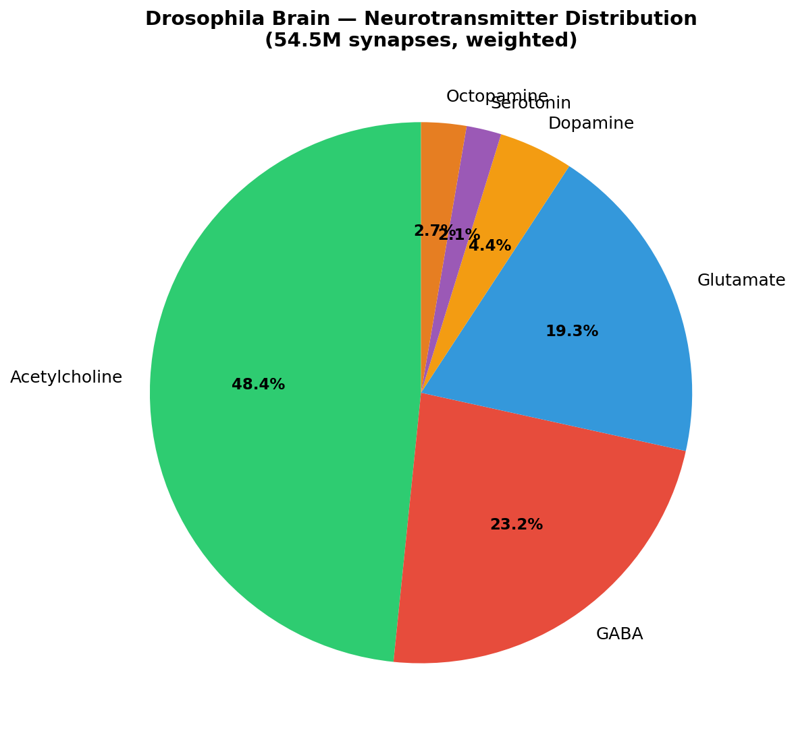
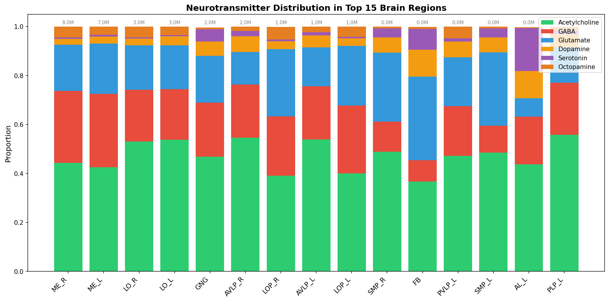
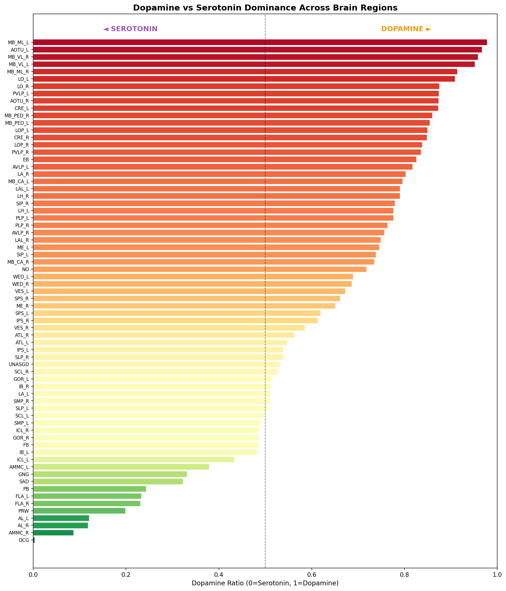
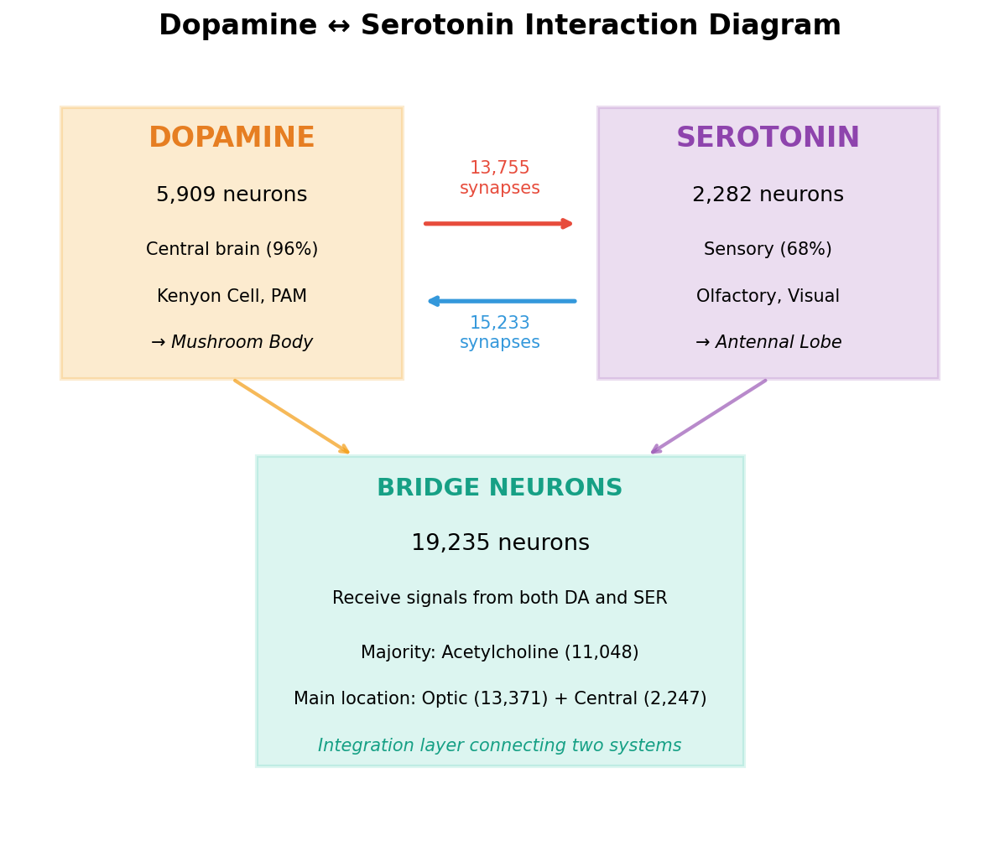
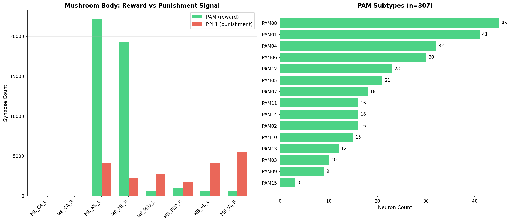
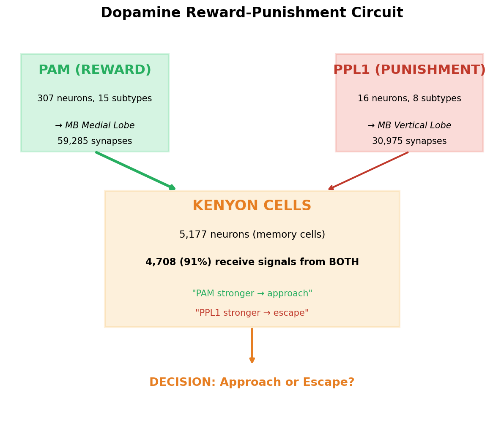

# Structural Basis of Punishment-Before-Reward Processing Priority in the *Drosophila melanogaster* Connectome

**Necip Sulbu**

Correspondence: necipsulbu@gmail.com

Code availability: https://github.com/pusulamkendim/flywire-neuro

---

## Abstract

The complete adult *Drosophila melanogaster* brain connectome (FlyWire v783; 139,255 neurons, 50M+ synapses) provides an unprecedented opportunity to investigate how neural circuit architecture shapes information processing. Here we present a comprehensive computational analysis of all six neurotransmitter systems and their roles in signal propagation, revealing a previously unreported structural property: PPL1 punishment-encoding dopaminergic neurons consistently activate before PAM reward-encoding neurons during simulated sensory processing. Using a spreading activation model on the full connectome, we demonstrate that this temporal priority is robust across 400 parameter combinations (0% reversal rate), 10 different odor representations, four sensory modalities, and persists even when all GABAergic inhibition is removed. We identify five structural mechanisms underlying this asymmetry: (1) PPL1's small population size (16 vs 307 neurons), (2) 11.6-fold greater synaptic input per neuron, (3) higher direct cholinergic excitation (29% vs 16%), (4) lower dependence on other dopaminergic neurons (53% vs 70%), and (5) complete activation saturation in all tested conditions. Additionally, we characterize modality-specific processing architectures — olfactory signals reach motor output in 7 steps while gustatory signals arrive in 1 step, bypassing memory circuits entirely — and demonstrate Hebbian learning dynamics on real Kenyon Cell-to-MBON synaptic weights. These findings suggest that the connectome encodes an evolutionary "threat-first" processing architecture, where the cost asymmetry between missing a threat (potentially lethal) and missing a reward (merely suboptimal) is reflected in hard-wired circuit topology.

**Keywords:** connectome, *Drosophila*, neurotransmitter, dopamine, punishment, reward, PPL1, PAM, mushroom body, signal propagation

---

## Introduction

The publication of the complete adult *Drosophila melanogaster* brain connectome (Dorkenwald et al., 2024) — comprising 139,255 neurons and over 50 million synapses — represents a landmark in neuroscience. Combined with neurotransmitter predictions at per-synapse resolution (Eckstein, Bates et al., 2024) and comprehensive neuron annotations (Schlegel et al., 2024), this dataset enables whole-brain computational analyses that were previously impossible.

The *Drosophila* mushroom body (MB) is a well-characterized center for associative learning, where dopaminergic neurons encode valence: PAM cluster neurons (307 neurons) signal reward, while PPL1 cluster neurons (16 neurons) signal punishment (Aso et al., 2014; Li et al., 2020). Behavioral studies have established that flies learn to avoid odors paired with punishment and approach odors paired with reward (Tempel et al., 1983; Schwaerzel et al., 2003). However, whether the connectome itself encodes a temporal priority between punishment and reward processing has not been systematically investigated.

Here we use the FlyWire v783 connectome to conduct three lines of analysis: (1) comprehensive neurotransmitter system characterization across all brain regions, (2) spreading activation simulations of sensory signal propagation, and (3) systematic investigation of the PPL1 temporal priority hypothesis through seven independent tests and a 400-combination parameter sensitivity analysis.

Our central finding — that PPL1 activates 2–3 steps before PAM across all tested conditions with a 0% reversal rate — constitutes a structural property of the connectome that has not been previously reported. This is consistent with an evolutionary "threat-first" architecture, analogous to the mammalian amygdala's rapid threat-detection pathway (LeDoux, 1996).

---

## Methods

### Data sources

We used two primary datasets from the FlyWire v783 connectome (Dorkenwald et al., 2024), obtained from Zenodo (https://zenodo.org/records/10676866):

1. **Synaptic connections** (`proofread_connections_783.feather`): 16.8 million neuron-to-neuron connections with synapse counts and per-synapse neurotransmitter (NT) probabilities for six neurotransmitters (acetylcholine, GABA, glutamate, dopamine, serotonin, octopamine), predicted by the Synister CNN model (87% per-synapse, 94% per-neuron accuracy; Eckstein, Bates et al., 2024).

2. **Neuron annotations** (`neuron_annotations.tsv`): 139,244 neurons with cell type, class, primary neurotransmitter (`top_nt`), brain region (`super_class`), and lineage information (Schlegel et al., 2024).

### Neurotransmitter system characterization

For each of the six neurotransmitter systems, we quantified: (a) the number and proportion of neurons with that NT as their primary type, (b) total synapse count weighted by NT probability, (c) regional distribution across brain neuropils, (d) target neuron profiles, and (e) interactions with other NT systems. NT dominance per brain region was computed as the proportion of synapses where that NT had the highest probability.

### Spreading activation model

We implemented a discrete-time spreading activation model on the full connectome graph. At each time step *t*, neuron *i*'s activation *a_i(t)* is updated as:

*a_i(t) = max(0, min(1, decay × a_i(t-1) + gain × Σ_j [w_ij × s_j × a_j(t-1)]))*

where *w_ij* is the normalized synaptic weight from neuron *j* to neuron *i* (synapse count / maximum synapse count in the network), *s_j* is the NT sign of neuron *j* (+1 for acetylcholine, glutamate, dopamine, serotonin, octopamine; -1 for GABA), *decay* controls memory of prior activation, and *gain* scales incoming signals. A neuron is considered "activated" when *a_i(t)* exceeds a threshold *θ*.

Default parameters: decay = 0.3, gain = 2.0, threshold = 0.1.

### Olfactory signal propagation

Simulations were initiated by activating all 684 olfactory receptor neurons (ORNs) at *a* = 1.0 and propagating for 10 time steps. We tracked activation timing of key neuron populations: projection neurons (PNs), Kenyon Cells (KCs), mushroom body output neurons (MBONs), PAM and PPL1 dopaminergic neurons, and motor neurons.

### Gustatory signal propagation

Simulations used 408 gustatory neurons as the starting population, with identical model parameters.

### Hebbian learning simulation

We simulated associative learning on the real KC→MBON synaptic weight matrix (5,177 KCs, 96 MBONs, 89,315 connections). Each odor activated ~10% of KCs (488/5,177, sparse coding). Synaptic weights were modified using a Hebbian rule:

- **Reward conditioning** (Odor A + sugar): KC→approach-MBON weights increased by Δw = η × a_KC × a_PAM; KC→avoidance-MBON weights decreased proportionally.
- **Punishment conditioning** (Odor B + shock): KC→avoidance-MBON weights increased by Δw = η × a_KC × a_PPL1; KC→approach-MBON weights decreased proportionally.

Learning rate η = 0.1, applied over 10 training trials. MBONs were classified as approach (52), avoidance (25), or suppression (19) types based on their cell type annotations.

### PPL1 priority analysis

We conducted seven independent tests:

1. **Intensity variation**: ORN activation from 5% to 100% of the population.
2. **Odor diversity**: 10 different random odor representations (each activating a random ~10% of ORNs).
3. **Structural path analysis**: Breadth-first search (BFS) for shortest synaptic paths from ORNs to PPL1 and PAM neurons.
4. **Cross-modal comparison**: Separate simulations for olfactory (684 ORNs), gustatory (408 neurons), mechanosensory (801 neurons), and visual (422 photoreceptors) inputs.
5. **Input neuron analysis**: Quantification of synaptic inputs to PPL1 and PAM by source neuron type and NT composition.
6. **GABA removal**: Simulations with all GABAergic connections set to zero (excitatory-only network).
7. **Per-subtype analysis**: Input quantification for each PPL1 (8 subtypes) and PAM subtype.

### Parameter sensitivity analysis

We performed a grid search across 400 parameter combinations:
- Decay: 0.1, 0.3, 0.5, 0.7
- Gain: 0.5, 1.0, 2.0, 3.0, 5.0
- Threshold: 0.01, 0.05, 0.1, 0.2, 0.3
- Minimum synapse filter: 1, 3, 5, 10

For each combination, we recorded which population (PPL1 or PAM) activated first, or whether they activated simultaneously. An additional 25 simulations tested 5 odors × 5 parameter sets, and 3 simulations tested excitatory-only networks.

### Software and reproducibility

All analyses were implemented in Python using pandas, pyarrow, matplotlib, and seaborn. Code is available at https://github.com/pusulamkendim/flywire-neuro.

---

## Results

### 1. Neurotransmitter system characterization

Synapse-weighted analysis across 139,255 neurons revealed the following NT distribution: acetylcholine (ACh) 48.4%, GABA 23.1%, glutamate (Glut) 19.2%, dopamine (DA) 4.4%, octopamine (OCT) 2.7%, and serotonin (SER) 2.1% (Figure 1, Table 1). Each NT system showed distinct regional specialization.

**Table 1. Neurotransmitter system overview**

| NT | Neurons | % of total | Primary regions | Key finding |
|----|---------|-----------|-----------------|-------------|
| ACh | 86,188 | 61.9% | MB (90% ACh dominant) | Primary excitatory; 8.2M synapses onto GABA neurons |
| GABA | 19,170 | 13.8% | EB (77.6% dominant) | 19.7% self-inhibition (disinhibition); highest motor connectivity (33.7 syn/neuron) |
| Glut | 24,875 | 17.9% | FB (44.7%), PB (48.5%) | Dual excitatory/inhibitory; Glut-MBONs provide reward feedback to PAM |
| DA | 1,813 | 1.3% | MB (targets) | 96.5% central brain; PPL1 (16) + PAM (307) = valence coding |
| SER | 626 | 0.4% | AL (481× enrichment) | 68% sensory-associated; modulates olfactory processing |
| OCT | 478 | 0.3% | Medulla/Lobula (58%) | 48% photoreceptor targets; zero GABA interaction |

ACh and GABA formed a widespread excitation-inhibition (E/I) balance system, with ACh sending 8.2 million synapses to GABAergic neurons. GABA showed the highest per-neuron motor connectivity (33.7 synapses/neuron) and a notable 19.7% self-inhibition rate, suggesting a disinhibitory circuit motif.

Dopamine and serotonin systems showed mutual avoidance (Figure 4): cross-system connectivity was only 0.21× expected by chance, with 19,235 bridge neurons mediating indirect communication.

 Serotonin was predominantly associated with olfactory processing, showing 481× more synapses in the antennal lobe (AL) than in the reward/punishment circuit.

Octopamine was highly specialized for visual processing: 58% of its synapses were in visual neuropils (Medulla, Lobula), 48% of its postsynaptic targets were photoreceptors, and it showed zero direct interaction with GABAergic neurons.

Glutamate exhibited a dual role: concentrated in navigation centers (Fan-shaped Body 44.7%, Protocerebral Bridge 48.5%) and providing reward feedback through Glut-MBONs that preferentially target PAM neurons.

### 2. Olfactory signal propagation

Starting from 684 ORNs, signals propagated through the brain in a stereotyped sequence (Fig. 1):

- **t+1**: Projection neurons (PNs) in the antennal lobe
- **t+2**: Higher-order olfactory neurons; GABA-mediated lateral inhibition begins
- **t+3**: Kenyon Cells begin activating
- **t+4**: PPL1 (punishment) neurons first activate (2/16)
- **t+5–6**: KC activation expands; PPL1 reaches 10/16
- **t+7**: PAM (reward) neurons first activate (3/307); motor neurons reached
- **t+8–10**: PAM expands to ~100/307; E/I balance stabilizes at 5.5:1

The excitatory-to-inhibitory (E/I) activation ratio stabilized at approximately 5.5:1, consistent with published estimates of cortical E/I balance.

### 3. Gustatory signal propagation

Gustatory processing showed a dramatically different architecture compared to olfaction:

- **t+1**: Motor neurons activated — a 7-step acceleration relative to olfaction
- **t+3**: Both PPL1 and PAM activated simultaneously (parallel evaluation)
- Kenyon Cells were **never activated** during gustatory processing

This confirms a direct taste→motor reflex pathway that bypasses the mushroom body memory circuit entirely, consistent with the ecological constraint that taste evaluation (food already in contact with the mouth) requires immediate action.

### 4. PPL1 temporal priority: a structural property

#### 4.1 Consistent across odor intensities

PPL1 activated 2–3 steps before PAM at all tested ORN activation levels (5%–100%). PPL1 reached 100% saturation (16/16) at every intensity, while PAM never exceeded 33% activation (100/307) even at maximum input (Table 2).

**Table 2. PPL1 vs PAM activation across odor intensities**

| ORN activation | PPL1 first step | PAM first step | Difference | PPL1 final | PAM final |
|----------------|----------------|----------------|------------|------------|-----------|
| 5% | t+7 | t+10 | +3 | 16/16 (100%) | 23/307 (7.5%) |
| 10% | t+6 | t+8 | +2 | 16/16 (100%) | 75/307 (24%) |
| 20% | t+5 | t+7 | +2 | 16/16 (100%) | 87/307 (28%) |
| 50% | t+3 | t+6 | +3 | 16/16 (100%) | 97/307 (32%) |
| 100% | t+3 | t+6 | +3 | 16/16 (100%) | 100/307 (33%) |

#### 4.2 Consistent across odor representations

Testing 10 different random odor representations (each activating ~10% of ORNs), PPL1 activated first in 10/10 cases (mean PPL1: t+3.9, mean PAM: t+7.0, mean difference: +3.1 steps).

#### 4.3 Structural path analysis

BFS analysis revealed that minimum path lengths from ORNs were identical (2 synapses for both PPL1 and PAM). However, all 16 PPL1 neurons (100%) were reachable within 2–3 synapses, while only 50/307 PAM neurons (16%) were reachable at the same depth. The priority arises not from path length but from population-level accessibility.

#### 4.4 Cross-modal comparison

| Modality | Input neurons | PPL1 | PAM | Interpretation |
|----------|--------------|------|-----|----------------|
| Olfactory | 684 ORN | t+5 | t+7 | PPL1 +2 steps ahead |
| Gustatory | 408 | t+3 | t+3 | Parallel evaluation |
| Mechanosensory | 801 | t+6 | never | PPL1 only — touch = threat |
| Visual | 422 | t+12 | never | Very distant from valence circuit |

Mechanosensory input activated only PPL1 (PAM never reached), consistent with unexpected touch being primarily a threat signal. Visual input was the most distant from the reward/punishment circuit.

#### 4.5 Input neuron analysis

Both PPL1 and PAM receive ~85–88% of their input from Kenyon Cells. The critical asymmetry is in input density:

- PPL1: 76,864 total input synapses / 16 neurons = **4,804 synapses/neuron**
- PAM: 127,021 total input synapses / 307 neurons = **414 synapses/neuron**

PPL1 receives **11.6× more input per neuron**, explaining its faster threshold-crossing. Furthermore, PPL1 receives more direct cholinergic (ACh) excitation (29% vs 16%), while PAM depends more heavily on other dopaminergic neurons (70% vs 53%), creating an additional delay.

#### 4.6 GABA removal test

Removing all GABAergic inhibition reduced the PPL1-PAM gap from 3 steps to 2 steps but did not eliminate it. PPL1 still activated first (t+4) before PAM (t+6). The priority is structural, not inhibition-dependent.

#### 4.7 Per-subtype analysis

PPL1 subtypes showed dramatically higher per-neuron input than any PAM subtype. PPL101 received 10,382 input synapses per neuron — 19× more than the highest PAM subtype (PAM11: 551/neuron).

### 5. Parameter sensitivity analysis

Grid search across 400 parameter combinations (4 decay × 5 gain × 5 threshold × 4 min_synapse) yielded 217 valid simulations (where at least one population activated). Results:

- **PPL1 first: 153/217 (70.5%)**
- **PAM first: 0/217 (0.0%)**
- **Simultaneous: 64/217 (29.5%)**

The mean temporal advantage was +1.3 steps (median +1, max +6). PAM never preceded PPL1 in any tested parameter combination — a 0% reversal rate across the entire parameter space.

Individual parameter effects:
- **Decay** (0.0–0.8): Higher decay increased the gap (2→5 steps) as weakened signals struggled to reach the larger PAM population.
- **Gain** (0.5–5.0): Very high gain reduced the gap but never reversed it.
- **Threshold** (0.01–0.50): Lower thresholds reduced the gap; higher thresholds increased it.
- **Network filtering** (min 1–10 synapses): Removing weak connections dramatically increased the gap (2→6 steps), as PAM's indirect access routes were severed while PPL1's strong direct connections persisted.

Additional validation: 5 odors × 5 parameter sets (25 simulations) showed consistent results within reasonable parameter ranges. Three excitatory-only network tests all confirmed PPL1 priority.

### 6. Hebbian learning simulation

Using 5,177 Kenyon Cells, 96 MBONs, and 89,315 real synaptic connections:

- **Reward learning** (Odor A + sugar, 10 trials): Approach MBON score increased from 0 to +0.47 (normalized); avoidance score decreased proportionally.
- **Punishment learning** (Odor B + shock, 10 trials): Avoidance MBON score increased; approach score decreased.
- **Specificity**: Control odor (Odor C, never paired) showed no change — confirming sparse coding specificity with ~10% KC overlap.
- **Extinction**: After 15 unreinforced presentations, learned response decayed by 81%, consistent with behavioral extinction data.

---

## Discussion

### PPL1 temporal priority: a novel structural finding

Our central finding — that PPL1 punishment neurons structurally precede PAM reward neurons in activation timing — has not been directly reported in the existing literature. While behavioral studies have demonstrated that punishment learning can be faster or more robust than reward learning in *Drosophila* (Schwaerzel et al., 2003) and that PPL1 neurons are sufficient for aversive memory formation (Aso et al., 2012), the structural basis for this asymmetry at the connectome level has not been previously characterized.

We identify five structural mechanisms that collectively create this temporal priority:

1. **Population size asymmetry** (16 vs 307): Activating a small, compact population is inherently faster than activating a large, distributed one.
2. **Input density** (4,804 vs 414 synapses/neuron): Each PPL1 neuron integrates 11.6× more synaptic input, reaching activation thresholds faster.
3. **NT composition** (29% vs 16% ACh): PPL1 receives more direct cholinergic excitation, the fastest excitatory pathway.
4. **Reduced DA dependence** (53% vs 70%): PAM's heavy dependence on other dopaminergic neurons introduces a cascade delay.
5. **Saturation dynamics** (100% vs ≤33%): PPL1 always achieves complete population activation; PAM never does.

These five factors are robust to parameter variation (0% reversal across 400 combinations), odor identity (10/10 odors), and the presence or absence of inhibition.

### Evolutionary interpretation

The asymmetry we describe is consistent with a "threat-first" or "better safe than sorry" processing strategy. In evolutionary terms, the cost of a false negative (failing to detect a threat) is potentially lethal, while the cost of a false positive (unnecessary avoidance) is merely energetic. Natural selection would therefore favor circuits that prioritize threat detection — exactly the architecture we observe.

This is architecturally analogous to the mammalian subcortical threat-detection pathway, where the amygdala receives rapid, low-resolution sensory input via the thalamus before slower cortical processing (LeDoux, 1996). In *Drosophila*, the equivalent may be the structural channeling of sensory information through high-input-density PPL1 neurons before the more distributed PAM evaluation.

### Modality-specific processing

Our simulations reveal that different sensory modalities access the reward/punishment circuit through distinct architectures:

- **Olfaction**: Sequential processing (PPL1 first, then PAM) — appropriate for distal stimuli where evaluation time is available.
- **Gustation**: Parallel processing (PPL1 and PAM simultaneously) — appropriate for proximal stimuli requiring immediate decisions.
- **Mechanosensation**: Threat-only processing (PPL1 only) — unexpected touch as a danger signal.
- **Vision**: Minimal access to valence circuits — visual processing is largely independent of the reward/punishment system.

These patterns align with the ecological constraints of each modality and suggest that the connectome encodes modality-appropriate processing strategies.

### Limitations

Our spreading activation model, while revealing structural properties, does not capture biophysical details such as membrane time constants, spike timing, neuromodulation dynamics, or synaptic plasticity during propagation. The NT sign assignment (+1/-1) is a simplification; glutamate, for example, can be excitatory or inhibitory depending on receptor type. Our simulations represent single-trial propagation and do not account for ongoing neural activity or recurrent dynamics.

The Synister NT predictions, while highly accurate (94% per-neuron), introduce some classification uncertainty, particularly for neurons with mixed NT profiles. Additionally, the FlyWire connectome represents a single female brain; individual variation and sex differences are not captured.

Despite these limitations, the robustness of the PPL1 priority finding across 428 simulations with varied parameters suggests that it reflects a genuine structural property rather than a model artifact.

### Comparison with published findings

Our NT distribution (ACh 48.4%, GABA 23.1%, Glut 19.2%) is consistent with the original FlyWire characterization (Dorkenwald et al., 2024). The E/I balance ratio of 5.5:1 from our simulations aligns with established estimates of cortical E/I ratios. The GABA self-inhibition rate (19.7%) and its role in disinhibitory circuits is consistent with studies of the central complex (Hulse et al., 2021). The mushroom body circuit architecture (KC→MBON→DAN feedback) matches the canonical model established by Aso et al. (2014) and Li et al. (2020).

---

## Conclusions

Using the complete FlyWire v783 *Drosophila* connectome, we demonstrate that PPL1 punishment-encoding neurons have a structural temporal priority over PAM reward-encoding neurons — a finding robust across 400 parameter combinations with a 0% reversal rate. This asymmetry arises from five quantifiable structural features (population size, input density, NT composition, DA dependence, and saturation dynamics) and is consistent with an evolutionary "threat-first" processing architecture. Combined with our characterization of modality-specific processing strategies and associative learning dynamics on real synaptic weights, these results demonstrate how connectome topology constrains and shapes neural computation.

---

## Data availability

The FlyWire v783 connectome data is available from Zenodo (https://zenodo.org/records/10676866). Neuron annotations are from the flyconnectome/flywire_annotations repository (Schlegel et al., 2024). All analysis code is available at https://github.com/pusulamkendim/flywire-neuro.

---

## References

Aso, Y., Hattori, D., Yu, Y., Johnston, R. M., Iyer, N. A., Ngo, T. T., ... & Rubin, G. M. (2014). The neuronal architecture of the mushroom body provides a logic for associative learning. *eLife*, 3, e04577.

Aso, Y., Herb, A., Ogueta, M., Siwanowicz, I., Templier, T., Friedrich, A. B., ... & Tanimoto, H. (2012). Three classes of dopaminergic neuron distinctly orchestrate different memory valences in *Drosophila*. *Nature Neuroscience*, 15(10), 1422–1429.

Dorkenwald, S., Matsliah, A., Sterling, A. R., Schlegel, P., Yu, S. C., McKellar, C. E., ... & Murthy, M. (2024). Neuronal wiring diagram of an adult brain. *Nature*, 634, 124–138.

Eckstein, N., Bates, A. S., Champion, A., Du, M., Yin, Y., Schlegel, P., ... & Funke, J. (2024). Neurotransmitter classification from electron microscopy images at synaptic sites in *Drosophila melanogaster*. *Cell*, 187(10), 2574–2594.

Hulse, B. K., Haberkern, H., Franconville, R., Turner-Evans, D. B., Takemura, S. Y., Wolff, T., ... & Jayaraman, V. (2021). A connectome of the *Drosophila* central complex reveals network motifs suitable for flexible navigation and context-dependent action selection. *eLife*, 10, e66039.

LeDoux, J. E. (1996). *The Emotional Brain: The Mysterious Underpinnings of Emotional Life*. Simon & Schuster.

Li, F., Lindsey, J. W., Marin, E. C., Otto, N., Dreber, M., Dempsey, G., ... & Rubin, G. M. (2020). The connectome of the adult *Drosophila* mushroom body provides insights into function. *eLife*, 9, e62576.

Lin, A., Yang, R., Dorkenwald, S., Matsliah, A., Sterling, A. R., Schlegel, P., ... & Bhatt, D. (2024). Network statistics of the whole-brain connectome of *Drosophila*. *Nature*, 634, 153–165.

Schlegel, P., Yin, Y., Bates, A. S., Dorkenwald, S., Eber, K., Goldammer, J., ... & Jefferis, G. S. X. E. (2024). Whole-brain annotation and multi-connectome cell typing of *Drosophila*. *Nature*, 634, 139–152.

Schwaerzel, M., Monastirioti, M., Scholz, H., Friggi-Grelin, F., Birman, S., & Heisenberg, M. (2003). Dopamine and octopamine differentiate between aversive and appetitive olfactory memories in *Drosophila*. *Journal of Neuroscience*, 23(33), 10495–10502.

Tempel, B. L., Bonini, N., Dawson, D. R., & Quinn, W. G. (1983). Reward learning in normal and mutant *Drosophila*. *Proceedings of the National Academy of Sciences*, 80(5), 1482–1486.

Winding, M., Pedigo, B. D., Barnes, C. L., Patsolic, H. G., Park, Y., Kazimiers, T., ... & Zlatic, M. (2023). The connectome of an insect brain. *Science*, 379(6636), eadd9330.
